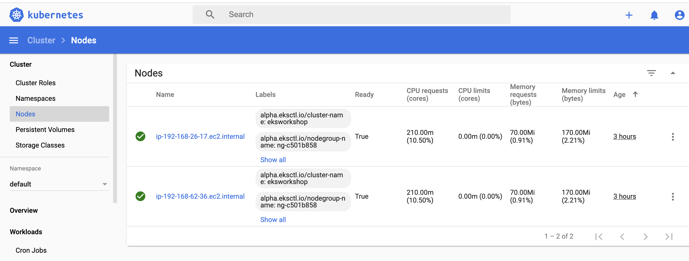

# 步骤5 部署官方的Kubernetes dashboard

5.1 下载配置文件

```bash
#2.0.0rc3

#部署
kubectl apply -f dashboard/recommended.yaml

kubectl get pods -n kubernetes-dashboard
kubectl get services -n kubernetes-dashboard


#获取登录的token
aws eks get-token --cluster-name ${CLUSTER_NAME} | jq -r '.status.token'


#方法1 将Dashboard 服务类型从默认的cluster 修改为LoadBalancer 通过AWS ELB提供对外服务,生产系统不推荐
#最新版本chrome不能访问，firefox 可以点高级点继续

#获取Dashboard访问地址
kubectl get svc kubernetes-dashboard -n kubernetes-dashboard -o json |  jq -r '.status.loadBalancer.ingress[].hostname'
#使用firefox 打开上述地址


#方法2 通过kubectl proxy 进行访问
#由于我们部署的EKS cluster是private cluster，所以我们需要通过 proxy. Kube-proxy进行访问Dashboard
kubectl proxy --port=8080 --address='0.0.0.0' --disable-filter=true &

#通过proxy进行访问
http://localhost:8080/api/v1/namespaces/kubernetes-dashboard/services/https:kubernetes-dashboard:/proxy/#!/login

#登录
#在cloud9里面选择tools -> preview -> preview run application

选择 Dashbaord 登录页面的 “Token” 单选按钮，复制上述命令的输出，粘贴，之后点击 Sign In。


```





**注意:** 新版本的chrome浏览器会禁止使用自签名https访问,所以推荐使用firefox访问dashboard

登录界面, 通过"aws eks get-token" 获取的TOKEN登录

```bash
aws eks get-token --cluster-name ${CLUSTER_NAME} --region ${AWS_REGION} | jq -r '.status.token'
```

